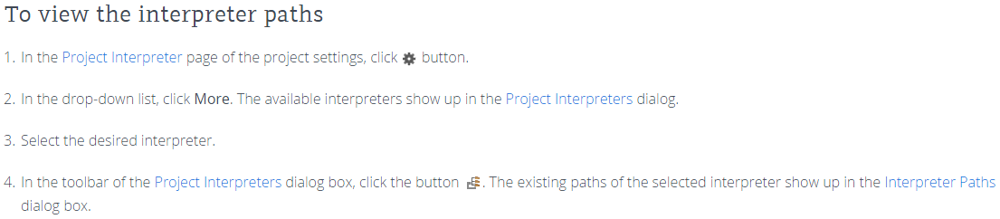
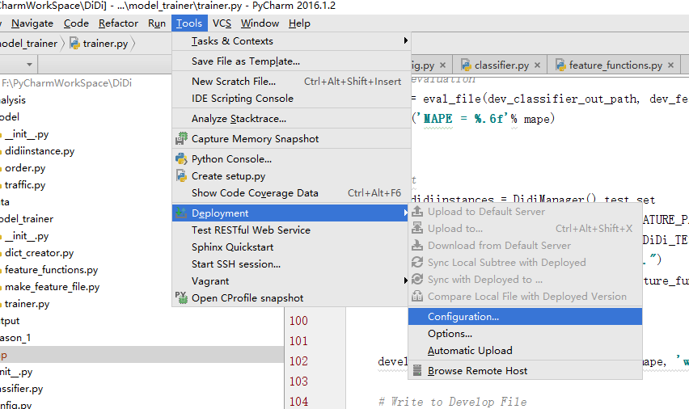
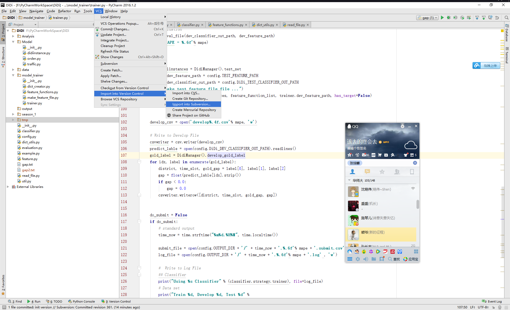
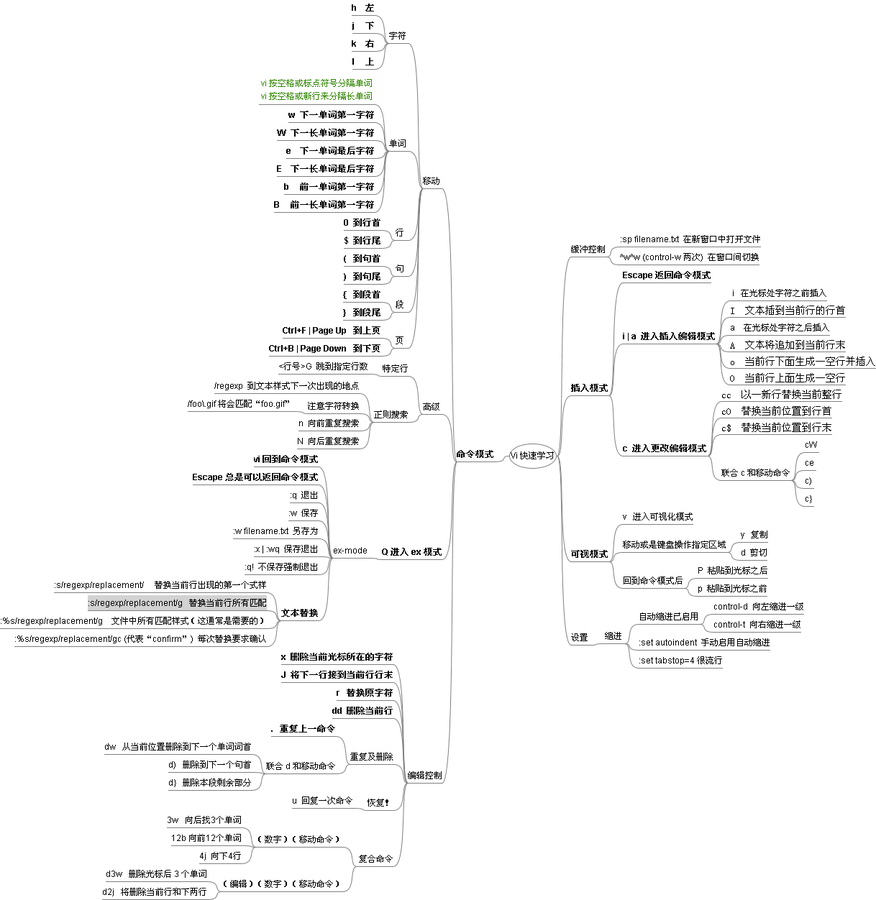

# Python-Tips


## 1.python2 和 python3 共享

```Shell
conda create --name py27 python=2.7 anaconda
conda create --name py35 python=3.5 anaconda
```
切换环境
```Shell
activate <env name> (Windows)
source activate <env name> (Linux)
```

## 2. pickle from python2 to python3

```Error
  File "H:\fixers - 3.4\addressfixer - 3.4\trunk\lib\address\address_generic.py"
, line 382, in read_ref_files
    d = pickle.load(open(mshelffile, 'rb'))
UnicodeDecodeError: 'ascii' codec can't decode byte 0xe2 in position 1: ordinal
not in range(128)
```
Solve Solution
```Python
with open(mshelffile, 'rb') as f:
    d = pickle.load(f, encoding='latin1') 
```

## 3. download file from Internet in Python

```python
import urllib.request, urllib.parse, urllib.error

origin = 'https://raw.githubusercontent.com/brmson/dataset-sts/master/data/para/msr/msr-para-train.tsv'
dataset = 'msr-para-train.tsv'
print('Downloading data from %s' % origin)
urllib.request.urlretrieve(origin, dataset)
```


## 4. pyCharm (2016.1) 添加 python 路径


## 5. Add Python Path In Linux
1. http://stackoverflow.com/questions/3402168/permanently-add-a-directory-to-pythonpath
2. ​
```
vi ~/.bashrc
export PYTHONPATH=${PYTHONPATH}:path1:path2
```

## 6. Git Operation
```git
git init
git add README.md
git commit -m "first commit"
git remote add origin https://github.com/rgtjf/test.git
git push -u origin master
```

## 7. Python Deployment and Subversion Configuration
### 1. Python Deployment: 映射到服务器, 可以上传, 下载

### 2. Share Project to Subversion: 映射到Subversion, 代码管理

### 3. How to setup Subversion in Ubuntu
http://www.krizna.com/ubuntu/setup-svn-server-on-ubuntu-14-04/

## 8.tmux
### 进入tmux
- 输入tmux 进入

### 分屏操作
- 分屏
  - Ctrl+b, ”：（先同时按住Ctrl和b, 然后按住”） 将当前面板平分为上下两块
  - Ctrl+b, %： 将当前面板平分为左右两块
- 去掉屏
  - Ctrl+b, x： 退出当前分出的一块小屏
  - Ctrl+b, &； 退出当前所有

### 退出tmux
- Ctrl+b, d: 退出并保留，下次可以重新进入

### 重新进入tmux
- tmux ls: 列出当前有哪些tmux窗口
- tmux attach -t 0: 重新连接第1个tmux窗口

### 其他
- Ctrl+b, PageUp: 在session中读取以前的页面，按~键退出
- Ctrl+b, 左右方向将：修改panel大小

### Update 0:
- Ctrl+b, ,: 重命名当前窗口；这样便于识别
- Ctrl+b,$: 重命名当前session
- Ctrl+b,z: 挂起当前session；恢复隐藏的session
- Ctrl+b,s: 以菜单方式显示和选择会话

### Update 1:
- Install on CentOS, https://gist.github.com/Root-shady/d48d5282651634f464af

## 9.jupyter-notebook

- Ref: http://jupyter-notebook.readthedocs.io/en/latest/public_server.html
- Prerequisite: A notebook configuration file
  create a notebook configuration file, ~/.jupyter/jupyter_notebook_config.py.

  If you don’t already have one, create a config file for the notebook using the following command:

  ```
  $ jupyter notebook --generate-config
  ```
- Running a public notebook server on shell(Ubuntu)

  ```
  $ jupyter notebook --no-browser
  ```
- Allow from other computer
  Setting ~/.jupyter/jupyter_notebook_config.py.

  ```
  # Set ip to '*' to bind on all interfaces (ips) for the public server
  c.NotebookApp.ip = '*'
  ```

## 10.solve GPU device not found on Ubuntu 14.04
- Error: 
  ```
  - CUDA_ERROR_NO_DEVICE
  - Couldn't open CUDA library libcudnn.so
  - No GPU devices available on machine.
  ```

- Solution:

  ```
  $ export CUDA_VISIBLE_DEVICES=0
  ```

  ```
  $ sudo ln -s /usr/lib/x86_64-linux-gnu/libcuda.so.1 /usr/lib/x86_64-linux-gnu/libcuda.so
  ```

## 11.PyCharm使用技巧
Update 2017.10.28
- `Alt+J` 类似sublime ``Ctrl+D``

---
- `ctrl+alt+L`, 格式化代码
- `alt+enter`, 出错万能键，不同场景有不同的表现方式，在还没import(install)模块名上使用会import(install)相对应的模块，在方法名上使用补注释，在测试中使用帮你补充断言代码……
- `ctrl+space`, 万能提示键 `ctrl+space` 万能提示键，PyCharm的会根据上下文提供补全。不仅是代码提示，`ctrl+f`搜索的时候，不知道该键入啥时就按下，经常给人惊喜。在windows下由于输入法无法使用这个快捷键，`ctrl+alt+s`打开设置键入 keymap，在Keymap中搜索basic可以找到并修改它 (改为`shift+H`)
- 阅读代码快捷键
  - `ctrl+q`, 查注释 
  - `ctrl+shift+i`, 没注释时查源码 
  - `ctrl+p`, 调用方法时查看参数，在括号内按下，就知道当前位置该给啥参数，不过由于是Python，这里使用`ctrl+space`也可以达到很好的效果
- 变量或表达式的最后键入`.(点)`，出现提示后，看最下面的部分有各种代码模板，例如现有变量a，在下一行键入 a.(点)print 然后键入`tab`，Python2会变成`print a`，Python3会变成`print(a)`，还有if,else等各种常用的代码模板
- 双击`shift`搜索一切，不管是IDE功能、文件、方法、变量……都能搜索
- 写代码时快捷键
  - ctrl + / 快速注释
  - ctrl + d 复制光标所在的行
- 本机编辑，运行时使用了远程环境，省去了环境切换的麻烦。
- Reference: https://www.zhihu.com/question/37787004


## 12.Vim装逼指南

- [老司机乱谈编辑器之神——vim移动研发](http://bbs.utest.qq.com/524)

- [How to learn vim](https://github.com/dofy/learn-vim)

- 

- 

- 

- 

  ## 13.Translate Tools

- https://github.com/soimort/translate-shell
  - Support Google Translate (default), Bing Translator, Yandex.Translate and Apertium
  - Not designed to library(such as for python)
  - Require gawk
    - How to install gawk on Ubuntu 14.04?
  ```
  sudo apt-get update
  sudo apt-get install gawk
  ```
  - You can set the default via the update-alternatives mechanism, using the command
  ```
  sudo update-alternatives --config awk
  ```
  e.g.
  ```
  $ sudo update-alternatives --config awk
  There are 2 choices for the alternative awk (providing /usr/bin/awk).

    Selection    Path            Priority   Status
  ------------------------------------------------------------
  * 0            /usr/bin/gawk    10        auto mode
    1            /usr/bin/gawk    10        manual mode
    2            /usr/bin/mawk    5         manual mode

  Press enter to keep the current choice[*], or type selection number: 2
  update-alternatives: using /usr/bin/mawk to provide /usr/bin/awk (awk) in manual mode.
  ```

- https://github.com/terryyin/google-translate-python
  - No key, no authentication needed.
  - Now google has stop providing free translation API. So I have to switch to http://mymemory.translated.net/

- https://github.com/ssut/py-googletrans

- goslate, Free Lunch is over!

- textblob [It works!]
  Update Info: https://github.com/sloria/TextBlob/issues/137#issuecomment-244777902

- WebSite:
  Google Document Translator: https://translate.google.com/?tr=f&hl=en (5000 limit)
  Bing Translator https://www.bing.com/translator (5000 limit)

  ## 14.[socher's homepage](http://www.socher.org/index.php/Main/HomePage)
- [Latex Thesis Template](http://www.socher.org/index.php/Main/CompleteLatexThesisFramework)
- [Some Useful Linux or Unix Commands](http://www.socher.org/index.php/Main/LinuxUnixCommands)

## 15. Numpy BroadCasting
- Ref: http://docs.scipy.org/doc/numpy/user/basics.broadcasting.html 
  When operating on two arrays, NumPy compares their shapes element-wise. It starts with the trailing dimensions, and works its way forward. Two dimensions are compatible when
  1. they are equal, or
  2. one of them is 1

  ```
  Image  (3d array): 256 x 256 x 3
  Scale  (1d array):             3
  Result (3d array): 256 x 256 x 3

  A      (4d array):  8 x 1 x 6 x 1
  B      (3d array):      7 x 1 x 5
  Result (4d array):  8 x 7 x 6 x 5
  ```

## 16. How to fix Selenium WebDriverException: The browser appears to have exited before we could connect?
- [Ref](http://stackoverflow.com/questions/26070834/how-to-fix-selenium-webdriverexception-the-browser-appears-to-have-exited-befor)

  ​

  ```bash
  $ echo $DISPLAY
  $ export DISPLAY=:0 # export DISPLAY=:localhost:11.0
  $ python login.py
  ```

## 17.Linux 更改文件权限，所有者
- 语法：chmod [who] [+ | - | =] [mode] 文件名
- 命令中各选项的含义为
    - u 表示“用户（user）”，即文件或目录的所有者。
    - g 表示“同组（group）用户”，即与文件属主有相同组ID的所有用户。
    - o 表示“其他（others）用户”。
    - a 表示“所有（all）用户”。它是系统默认值。
- 操作符号可以是：
    - + 添加某个权限。
    - - 取消某个权限。
    - = 赋予给定权限并取消其他所有权限（如果有的话）。
- 设置mode所表示的权限可用下述字母的任意组合：
    - r 可读。
    - w 可写。
    - x 可执行。
    - X 只有目标文件对某些用户是可执行的或该目标文件是目录时才追加x 属性。
    - s 在文件执行时把进程的属主或组ID置为该文件的文件属主。方式“u＋s”设置文件的用户ID位，“g＋s”设置组ID位。
    - t 保存程序的文本到交换设备上。
    - u 与文件属主拥有一样的权限。
    - g 与和文件属主同组的用户拥有一样的权限。
    - o 与其他用户拥有一样的权限。

```bash
  chmod -R 755 data_dir
  chown -R user data_dir
```

## 17. Python 学习路线
- https://learnxinyminutes.com/docs/python/
- http://wuzhiwei.net/be_pythonic/
    - http://sahandsaba.com/thirty-python-language-features-and-tricks-you-may-not-know.html
    - api: https://docs.python.org/2/library/functions.html

## 18. Terminal 快捷键 

```bash
Ctrl + A:	Go to the beginning
Ctrl + E:   Go to the end
Ctrl + <-:  Move cursor forward one word on the current line
Ctrl + ->:  Move cursor backward one word on the current line

Ctrl + L:   Clear the Screen
Ctrl + U:   Clear the line before the cursor
Ctrl + K:   Clear the line after the cursor
Ctrl + H:   Same as backspace

Ctrl + R:   Search through previously used commands
```
## 19. Matplotlib.pyplot 使用

- example1

  ```python
  import matplotlib.pyplot as plt
  x = [1, 2, 3, 4]
  y = [1, 4, 9, 16]
  plt.plot(x, y)
  plt.show()
  ```

  ​

- example2

  设置折线点的属性

  ```python
  import numpy as np
  import matplotlib.pyplot as plt

  # evenly sampled time at 200ms intervals
  t = np.arange(0., 5., 0.2)

  # red dashes, blue squares and green triangles
  plt.plot(t, t, 'r--', t, t**2, 'bs', t, t**3, 'g^-')
  plt.show()
  ```

- example3

  解决中文编码问题

  ```python

  import matplotlib.font_manager as fm
  myfont = fm.FontProperties(fname='C:/Windows/Fonts/msyh.ttc')

  import matplotlib.pyplot as plt

  x = [1, 2, 3, 4]
  y = [1, 4, 9, 16]

  plt.plot(x, y, 'rs-')

  plt.xlabel('横坐标轴', fontproperties=myfont, fontsize=30, color='black')
  plt.ylabel('纵坐标轴', fontproperties=myfont, fontsize=30, color='black')
  plt.title("解决中文编码问题",fontproperties=myfont, fontsize=28, color='black')
  		
  plt.show()
  ```

- example 4

  在点上面打标签

  ```python
  import matplotlib.pyplot as plt

  x = [1, 2, 3, 4]
  y = [1, 4, 9, 16]

  plt.plot(x, y, 'rs-')
  for xy in zip(x, y):
      plt.annotate("(%s, %s)" % xy, xy=xy, xytext=(-40, 8), textcoords='offset points')
  plt.show()
  ```

- example 5

  多条折线添加标注

  ```python
  import matplotlib.pyplot as plt

  x = [1, 2, 3, 4]
  y1 = [1, 4, 9, 16]
  y2 = [1, 8, 27, 64]
  plt.plot(x, y1, 'rs-', label='two')
  plt.plot(x, y2, 'bs-', label='three')

  plt.legend(loc='lower right')
  plt.show()
  ```

  ​

## Pycharm Edit 快捷键


## Python Class __call__ 方法

```
class Animal(object):

    __call__(self, words):
        print "Hello: ", words

if __name__ == "__main__":
    cat = Animal()
    cat("I am cat!")

>>> Hello: I am cat!
```

## Python classmethod 和 staticmethod
- staticmethod 相当于函数
- classmethod 可以调用类函数，比如构造一个对象等

## Python selenium & autoit
- http://selenium-python.readthedocs.io/api.html
- Notes:
  - 1. iframe 和 windows 之间的切换
  - 2. upload file: Hard to modify
	- autoit
  - 3. lxml.html 解决table问题
    - http://stackoverflow.com/questions/27592444/getting-text-of-a-table-quickly-in-selenium
  - 4. Others
    - javascript in selenium  http://stackoverflow.com/questions/38315819/how-to-execute-a-javascript-function-defined-in-the-website-script-with-seleniu
	
## Asiya
- http://nlp.lsi.upc.edu/asiya/Asiya_technical_manual_v3.0.pdf
- Metric Set
  - Lexical Similarity
    - Edit Distance
	   - WER (Word Error Rate): Levenshtein Distance
	   - PER (Position-independent WER): Word Order is not taken into consideration
	   - TER (Translation Edit Rate)
	   - ALIGN
	   - BLEU
	   - NIST
	   - P_l (Lexical Precision)
	- Lexical Recall
	   - ROUGE
	   - R_l
	- F_Measure
	   - GTM
	   - MENETOR
	   - F_l
	   - O_l
	- NGRAM
  - Syntactic Similarity
    - On Shallow Parsing (SP)
	- On Dependency Parsing (DP)	
    - On Constituent Parsing (CP)
  - Semantic Similarity
	- On Named Entities (NE)
	- On Explicit Semantic Analysis (ESA)
	- On Semantic Roles (SR)
	- On Discourse Representations (DR)
	
## Multiple selections in pycharm
- https://blog.jetbrains.com/pycharm/2014/09/feature-spotlight-multiple-selections-in-pycharm/
  - Alt + Mouse Click
  - Alt + J (Select Next Occurrence)

  
## 26. precision 服务器安装指南
- Anaconda
- python-package
    - pip install --upgrade pip
    - /opt/dynet-base/dynet/build/python# python setup.py install 
	- pip install tensorflow-gpu
	- pyprind
	- Lasagne
      - pip install -r https://raw.githubusercontent.com/Lasagne/Lasagne/v0.1/requirements.txt
	  - pip install Lasagne==0.1
	- pip install --upgrade gensim
	- /home/precision/xgboost/python-package# python setup.py install
	- pip install pyjsonrpc
	- pip install selenium
	
## 27. 打包、解压缩

- tar czf small.tar.gz small(目录名)  ;压缩并打包目录
- tar zxvf small.tar.gz

## 28. Latex font size

```
   \tiny  < \scriptsize \footnotesize < \small
 < \normalsize
 < \large < \Large < \LARGE
 < \huge  < \Huge
```

